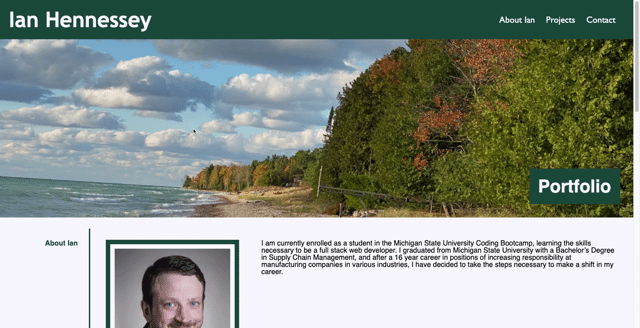

 # Portfolio
 

   
   

  # Table of Contents
  - [Description](#Description)
  - [Usage](#Usage)
  - [License and Copyright](#License-and-Copyright)
  - [Citations](#Citations)
  - [Questions](#Questions)
  
  # Description
  
This project was meant to build a professional portfolio using react that could be shown to a potential employer so that they can view some examples of the work I am capable of.  The goal being to set up a professional looking webpage with links to sample projects that will allow me to add images and links as I deploy more applications and can continue to add examples to show to a potential employer.  Styled with colors that match well with Michigan State University's school colors as I am attending the Michigan State University Coding Bootcamp.
The application includes a contact form that sends an email message to me using emailJS and the ability to download my resume.
 
    
   
  # Usage
  
The user will need to navigate to the URL for the application.  A link to the deployed application is provided below.  
[Deployed Application on GitHub Pages](<https://atleastitsanethosman.github.io/portfoliosample/>)
  
  # License and Copyright
  
  Copyright 2021 Ian Hennessey
  
   

  
      Permission is hereby granted, free of charge, to any person obtaining a copy of this software and associated documentation files (the "Software"), to deal in the Software without restriction, including without limitation the rights to use, copy, modify, merge, publish, distribute, sublicense, and/or sell copies of the Software, and to permit persons to whom the Software is furnished to do so, subject to the following conditions:
      
      The above copyright notice and this permission notice shall be included in all copies or substantial portions of the Software.
      
      THE SOFTWARE IS PROVIDED "AS IS", WITHOUT WARRANTY OF ANY KIND, EXPRESS OR IMPLIED, INCLUDING BUT NOT LIMITED TO THE WARRANTIES OF MERCHANTABILITY, FITNESS FOR A PARTICULAR PURPOSE AND NONINFRINGEMENT. IN NO EVENT SHALL THE AUTHORS OR COPYRIGHT HOLDERS BE LIABLE FOR ANY CLAIM, DAMAGES OR OTHER LIABILITY, WHETHER IN AN ACTION OF CONTRACT, TORT OR OTHERWISE, ARISING FROM, OUT OF OR IN CONNECTION WITH THE SOFTWARE OR THE USE OR OTHER DEALINGS IN THE SOFTWARE.
      

   

  [License: The MIT License](<https://opensource.org/licenses/MIT>)

   

  # Citations

  
  react  
  emailJS  
  react-hook-form  
  fontAweson  

  # Questions?
  Please reach out to Ian Hennessey using the contact options below:  
  [GitHub Profile](<https://github.com/atleastitsanethosman>) 
  [Email](<mailto:ian.hennessey@gmail.com>)

